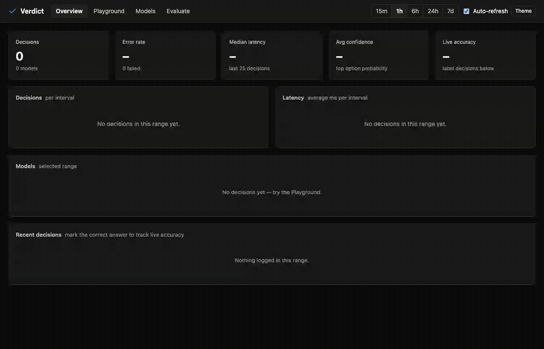

# Verdict

[](https://github.com/pras-ops/Verdict/actions/workflows/ci.yml)
[](LICENSE)


**Turn any LLM into a decision engine.** Ask a question with a fixed set of answers and get a
**probability for every answer**, read straight from the model's next-token probabilities.
No text generation, no parsing.



<sub>Real run on a laptop with Ollama (qwen2.5 7b and 14b). Waiting time is fast-forwarded.</sub>

```
context + question + options ──► prompt with lettered options + "Answer:"
                               ──► one forward pass: read P(" A"), P(" B"), ...
                               ──► normalise (+ calibration) ──► {option: probability}
```

It works with the model you already run: **Ollama, vLLM, llama.cpp, Hugging Face, OpenAI and
any OpenAI-compatible API**. It also speaks the **Jev / System One** decision API in both
directions, so Jev clients can use your local models, and Verdict can calibrate and benchmark
Jev, Laya or Ollama decision models.

| | |
|---|---|
| **Three kinds of question** | pick one of up to 26 options · yes/no · a score on a 0–9 scale |
| **Honest numbers** | calibration from your own labelled examples, position-bias removal, an "unsure" flag |
| **Many ways in** | Python library · CLI with batch CSV/JSONL · REST API · Jev-compatible `/v1/systemone` · MCP server for AI agents |
| **Ops built in** | dashboard, SQLite decision log, live accuracy from feedback, Prometheus `/metrics` |

## Quick start

Needs Python 3.10+. Not on PyPI yet; when it is, it will install as `pip install verdict-llm`.

```bash
git clone https://github.com/pras-ops/Verdict.git
cd Verdict
pip install -e .              # extras: ".[hf]" Hugging Face, ".[mcp]" MCP server
ollama pull qwen3:4b          # any chat model; see "Choosing a model"
verdict serve                 # dashboard on http://localhost:8420
```

Open **Models**, pick the *Ollama (local)* preset, save, then try it in **Playground**.

From the terminal:

```bash
verdict decide "Which folder should this go to?" -o Work -o Personal -o Spam \
  -c "You won a prize, click here" -m qwen3:4b
```

```json
{ "choice": "Spam", "probs": {"Work": 0.0, "Personal": 0.007, "Spam": 0.993},
  "confidence": 0.993, "coverage": 1.0, "method": "logprobs", "latency_ms": 179.0, ... }
```

Add `-q` to print just the answer: handy in shell scripts.

## Python

```python
from verdict import Verdict

v = Verdict.from_backend("ollama", model="qwen3:4b")

r = v.choose("Which folder?", ["Work", "Personal", "Spam"], context=email)
r.choice, r.probs, r.confidence, r.coverage   # 'Spam', {'Work': 0.001, ...}, 0.993, 1.0

v.yes_no("Is this urgent?", context=ticket).score                       # P(yes)
v.score("How angry is the customer?", context=msg, scale=(1, 5)).value  # expected rating, e.g. 4.48

v.choose(..., debias=True)          # also ask with options reversed and average (2 calls)
v.choose(..., debias="rotate")      # ask once per rotation: cancels position bias fully (n calls)
v.choose(..., min_confidence=0.8)   # result.abstained is True when the model is less sure: route to a human

v.decide_many([{...}, {...}], workers=4)   # many decisions in parallel, order kept
```

Several questions about one input, in the Jev / System One format:

```python
v.ask(ticket, {
    "department":  {"type": "choice", "instructions": "Which team should handle this?",
                    "criteria": {"billing": "Payments, refunds", "technical": "Bugs and outages"}},
    "frustration": {"type": "score", "instructions": "How frustrated is the customer?",
                    "criteria": ["Calm", "Annoyed", "Very angry"]},
    "urgent":      {"type": "noul", "instructions": "Does this need a reply today?"},
})
# {"model": ..., "answers": {"department": {"type": "choice", "choice": "billing",
#   "probabilities": {...}, "confidence": 0.93}, "frustration": {...}, "urgent": {"type": "noul", "noul": 0.97}}, "usage": {...}}
```

## Command line

```bash
verdict decide QUESTION [-o OPTION ...] [-c CONTEXT] [--scale 1-5] [--debias] [-q]
verdict batch tickets.csv --question "Which team?" -o Billing -o Support -o Sales --output out.csv
verdict batch decisions.jsonl --output results.jsonl --workers 8   # each line a full decision
verdict serve [--port 8420] [--token SECRET] [--default-model NAME]
verdict mcp -b ollama -m qwen3:4b                                  # MCP server on stdio
```

Every command takes `-b/--backend`, `-m/--model`, `--base-url`, `--api-key-env` and
`--set key=value` for any other backend setting (environment: `VERDICT_BACKEND`, `VERDICT_MODEL`,
`VERDICT_BASE_URL`). `batch` adds `choice`, `confidence`, `coverage` (and `p_yes` or `value`) to
every row, keeps your other columns, and writes the error message on rows that failed.

## Backends and providers

| Provider | Backend | Real probabilities? | Tested in this repo |
|---|---|---|---|
| **Ollama** ≥ 0.12.11 | `ollama` | yes | ✅ qwen2.5:7b, qwen2.5:14b (Ollama 0.33) |
| Ollama's OpenAI-compatible `/v1` | `openai` | yes | ✅ same models |
| **Hugging Face transformers** | `huggingface` | yes, exact (full vocabulary) | ✅ Qwen2.5-0.5B-Instruct (transformers 5.19) |
| vLLM | `openai`, `prefill=true` | yes | simulated responses |
| llama.cpp `llama-server` | `openai` | yes | — |
| OpenAI gpt-4o, gpt-4.1 | `openai` | yes | simulated responses |
| OpenAI gpt-5.1+, GPT-6 Sol/Luna | `openai` | yes: Verdict sends `reasoning_effort="none"` automatically | simulated responses |
| OpenAI gpt-5, o-series, GPT-6 Astra | `openai` | no → plain answer (`method="constrained"`) | simulated responses |
| OpenRouter | `openai` | depends on the provider behind the model | — |
| Groq, Gemini 3, Claude (OpenAI SDK compatibility), LM Studio chat, xAI grok-4.20+ | `openai` | no → plain answer | — |
| **Jev** (TypeSafe), Laya, Ollama decision models (≥ 0.35), another Verdict | `systemone` | yes, their own | ✅ against a Verdict server |
| Fake model for demos and tests | `mock` | — | ✅ |

The dashboard's **Preset** menu fills these in. When a server rejects a setting (for example
OpenAI reasoning models refuse `temperature=0` and `max_tokens`), Verdict adjusts the request,
remembers it for that model, and carries on. When a model can't return probabilities at all, it
falls back to **constrained output** (a JSON schema with an enum) and marks the result
`method="constrained"`: you still get an answer, but 0/1 instead of probabilities.

Add your own connector:

```python
from verdict import Backend, register_backend

@register_backend
class MyBackend(Backend):
    kind = "mine"
    def top_logprobs(self, prompt, k=20):
        ...  # return [(token, logprob), ...] for the first generated token
```

### Choosing a model

Small instruct models do well on clear-cut decisions; bigger ones are better at tricky ones (see
the benchmark below). Good small Ollama choices: `qwen3:4b` (Verdict turns thinking off),
`gemma3:4b`, `llama3.2:3b`. Comparing several big local models at the same time can make Ollama
swap them in and out of memory, which shows up as multi-second latency.

## Reading a result

- `probs`: probability per option; sums to 1
- `confidence`: probability of the chosen option
- `coverage`: how much of the model's probability landed on valid answers at all. Below 50%
  the model wanted to say something else: treat the answer with care
- `method`: `logprobs` (real probabilities) or `constrained` (fallback, 0/1 only)
- `abstained`: true when you set `min_confidence` and the model was less sure than that

## Calibration

Raw LLM probabilities are usually over-confident: in our benchmark the models averaged 95–98%
confidence while being right 83–92% of the time. In **Evaluate**, paste labelled examples (one JSON
per line) or click *Load the 36-example benchmark*, run them, and Verdict fits a **temperature**
that minimises log-loss. *Apply temp.* then calibrates every later decision from that model.

Verdict only offers to apply it with **at least 30 examples that include some mistakes**. With
fewer, or a perfect score, the fit can only say "be even more confident", which makes things worse.
You can also label live decisions on the Overview page to track real-world accuracy.

## Jev / System One compatible API

`verdict serve` answers `POST /v1/systemone` in the same request and response shape as TypeSafe's
Jev API, so Jev clients and SDKs can point at Verdict by changing the base URL:

```bash
curl -s localhost:8420/v1/systemone -H 'Content-Type: application/json' -d '{
  "model": "jev-latest",
  "state": "Hi, I was charged twice for my subscription this month.",
  "questions": {
    "department": {"type": "choice", "instructions": "Which team should handle this?",
                   "criteria": {"billing": "Payments, refunds", "technical": "Bugs and outages"}},
    "urgent": {"type": "noul", "instructions": "Does this need a reply today?"}
  }}'
```

`model` picks a registered Verdict model; any other name (like `jev-latest`) uses `--default-model`,
or the first model you registered. Differences from hosted Jev: at most 26 choice options (Jev
allows 255), `usage` token counts are estimates, and `confidence` is 1 − normalised entropy.

The other direction works too: the `systemone` backend sends Verdict's questions to any
Jev-compatible service, so you can calibrate, debias, benchmark and monitor Jev, Laya or Ollama
decision models next to ordinary LLMs.

## MCP server for AI agents

`verdict mcp` gives agents four tools: `choose`, `yes_no`, `score` and `ask` (Jev format). Install
the extra with `pip install -e ".[mcp]"`, then:

```bash
claude mcp add verdict -- verdict mcp -b ollama -m qwen3:4b     # Claude Code
```

```json
{ "mcpServers": { "verdict": { "command": "verdict", "args": ["mcp", "-b", "ollama", "-m", "qwen3:4b"] } } }
```

(The JSON goes in Claude Desktop's or Cursor's MCP settings. Use the full path to `verdict` if it
isn't on the app's PATH.)

## REST API

| method | path | |
|---|---|---|
| POST | `/api/decide` | `{model, kind, question, options?, context?, scale?, debias?, min_confidence?}` |
| POST | `/api/compare` | same, with `models: [...]`; runs them in parallel |
| POST | `/v1/systemone` | Jev-compatible: one `state`, several named `questions` |
| POST | `/api/evaluate` | `{models, examples}` → accuracy, log-loss, ECE, fitted temperature, `reliable` |
| GET/POST/DELETE | `/api/models` | register models (secrets are masked in responses) |
| POST | `/api/models/{name}/test` | health check + probe decision |
| PUT | `/api/models/{name}/temperature` | set calibration |
| GET | `/api/decisions`, `/api/stats` | log and aggregates |
| POST | `/api/decisions/{id}/feedback` | `{label}`: the correct answer |
| GET | `/api/health` | liveness, never needs a token |
| GET | `/metrics` | Prometheus |

## Security

The server can call paid APIs with your keys, so by default it is locked down:

- It listens on `127.0.0.1` and only answers requests addressed to `localhost`, which stops web
  pages from reaching it through DNS rebinding.
- `--token SECRET` (or `VERDICT_TOKEN`) requires `Authorization: Bearer SECRET` on every API call;
  the dashboard asks for it once. Listening on another interface (`--host 0.0.0.0`) **refuses to
  start without a token** unless you pass `--no-auth`.
- API keys are read from environment variables (`api_key_env`), and only variables whose names end
  in `_API_KEY` (or start with `VERDICT_`) are allowed. Keys stored in a model's config are masked
  as `***` in every API response.
- The decision log (`verdict.db`) contains your prompts. It is git-ignored; treat it like any data file.

See [SECURITY.md](SECURITY.md) to report a vulnerability.

## Benchmark

36 labelled examples in [verdict/dashboard/benchmark.jsonl](verdict/dashboard/benchmark.jsonl):
email folders, support routing, urgency, sarcasm and 1–5 review scores, some of them deliberately
tricky (phishing that looks like work mail, a newsletter titled "URGENT!!!"). Run it on your own
models with `python examples/benchmark.py MODEL [MODEL ...]`.

| | qwen2.5:7b | qwen2.5:14b |
|---|---|---|
| Accuracy, v0.1 → v0.2 | 80.6% → **83.3%** | 91.7% → 91.7% |
| Coverage on 1–5 scores, v0.1 → v0.2 | 0% → **100%** | 0% → **100%** |
| Log-loss v0.2, raw → calibrated | 1.33 → 0.46 | 0.28 → 0.14 |
| Time per question | ~190 ms | ~370 ms |

Measured on an Apple M4 Pro with Ollama 0.33. In v0.1, score questions read the digits from
near-zero noise: these tokenizers write a bare space after "Answer:" before the number, and v0.2
now looks one token further when that happens.

## Prometheus and Grafana

Point Prometheus at `/metrics` (add `authorization: {credentials: SECRET}` when you use `--token`) and
build panels on `verdict_decisions_total`, `verdict_errors_total`, `verdict_constrained_total`,
`verdict_correct_total / verdict_labelled_total` (live accuracy) and `verdict_latency_ms_bucket`.

```yaml
scrape_configs:
  - job_name: verdict
    static_configs: [{ targets: ["127.0.0.1:8420"] }]
```

## Limits

- Choice questions support up to 26 options (A–Z); scores are single-digit scales (0–9).
- `top_logprobs` APIs cap at 20 tokens; options outside the top 20 get an upper-bound estimate.
- Chat models answer much better than base models (watch `coverage`).

## Development

```bash
pip install -e ".[dev]"
pytest                                                  # fast tests, no model needed
VERDICT_LIVE_MODEL=qwen2.5:7b pytest -m live            # against a running Ollama
VERDICT_HF_MODEL=Qwen/Qwen2.5-0.5B-Instruct pytest -m hf
ruff check .
```

`scripts/record_demo.py` re-records `docs/demo.gif` from a live dashboard. See
[CONTRIBUTING.md](CONTRIBUTING.md) and the [changelog](CHANGELOG.md).

## License

[MIT](LICENSE)
